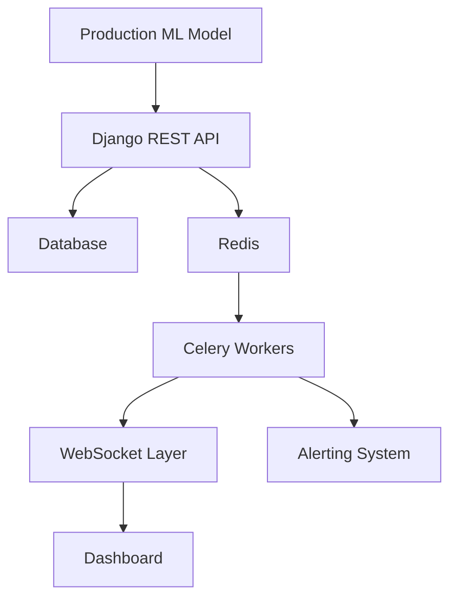

# MLOps Model Monitoring Dashboard

A real-time monitoring system for machine learning models in production. This platform provides comprehensive monitoring capabilities to detect performance degradation, data drift, concept drift, and infrastructure issues before they impact business.

## Features

- **Real-time Performance Monitoring**: Track accuracy, precision, recall, F1-score, and other metrics
- **Data Drift Detection**: Identify changes in input feature distributions using PSI, KS test, and KL divergence
- **Concept Drift Detection**: Monitor changes in the relationship between features and targets
- **Data Quality Monitoring**: Detect missing values, outliers, type mismatches, and schema violations
- **Alerting System**: Automated alerts for critical issues with configurable thresholds
- **Dashboard Visualization**: Interactive charts and real-time updates
- **WebSocket Integration**: Live updates to the dashboard
- **RESTful API**: Programmatic access to all monitoring data
- **Model Training Pipeline**: Train new models directly through the platform
- **Automated Data Cleaning Pipeline**: Comprehensive data preprocessing and cleaning capabilities

## Tech Stack

- **Backend**: Python + Django 5.x + Django REST Framework
- **Frontend**: HTML5 + TailwindCSS + Vanilla JavaScript
- **Database**: SQLite (development) / PostgreSQL (production)
- **Real-time**: Django Channels + WebSockets
- **ML Libraries**: scikit-learn, numpy, pandas, scipy
- **Visualization**: Chart.js, Cytoscape.js
- **Task Queue**: Celery with Redis

## Architecture



## Installation

1. **Clone the repository**:
   ```bash
   git clone <repository-url>
   cd mlops-monitor
   ```

2. **Create a virtual environment** (recommended):
   ```bash
   python -m venv venv
   source venv/bin/activate  # On Windows: venv\Scripts\activate
   ```

3. **Install dependencies**:
   ```bash
   pip install -r requirements.txt
   ```

4. **Run migrations**:
   ```bash
   python manage.py migrate
   ```

5. **Create a superuser** (optional):
   ```bash
   python manage.py createsuperuser
   ```

6. **Generate sample data** (for testing):
   ```bash
   python manage.py generate_sample_data
   ```

7. **Run the development server**:
   ```bash
   python manage.py runserver
   ```

## Usage

### 1. Register a Model
```bash
curl -X POST http://localhost:8000/api/models/ \
  -H "Content-Type: application/json" \
  -d '{
    "name": "FraudDetectionModel",
    "version": "v1.0",
    "description": "Credit card fraud detection model"
  }'
```

### 2. Log Predictions
```bash
curl -X POST http://localhost:8000/api/predictions/ \
  -H "Content-Type: application/json" \
  -d '{
    "model": "MODEL_UUID",
    "input_data": {
      "transaction_amount": 250.75,
      "user_age": 34,
      "account_age_days": 365
    },
    "prediction": {
      "probability": 0.87,
      "confidence": 0.92,
      "class": "fraud"
    },
    "latency_ms": 45
  }'
```

### 3. Train a New Model
```bash
curl -X POST http://localhost:8000/api/train/ \
  -H "Content-Type: application/json" \
  -d '{
    "data": [
      {"feature1": 1.0, "feature2": 2.0, "target": 0},
      {"feature1": 2.0, "feature2": 3.0, "target": 1}
    ],
    "target_column": "target",
    "model_name": "MyTrainedModel",
    "algorithm": "random_forest"
  }'
```

### 4. Clean Data
```bash
curl -X POST http://localhost:8000/api/clean-data/ \
  -H "Content-Type: application/json" \
  -d '{
    "data": [
      {"feature1": 1.0, "feature2": null, "category": "A"},
      {"feature1": null, "feature2": 3.0, "category": "B"}
    ],
    "config": {
      "handle_missing": true,
      "encode_categorical": true
    }
  }'
```

### 5. Run Monitoring Tasks
```bash
python manage.py run_monitoring
```

## Frontend Input Functionality

The dashboard now includes a form for submitting predictions directly from the browser:

1. Navigate to a model's detail page (e.g., `http://localhost:8000/models/MODEL_UUID/`)
2. Scroll to the "Submit New Prediction" section
3. Enter your input data and prediction result in JSON format
4. Optionally add latency information
5. Click "Submit Prediction"

Example input data:
```json
{
  "age": 35,
  "income": 50000,
  "credit_score": 720
}
```

Example prediction result:
```json
{
  "class": "approved",
  "probability": 0.85
}
```

## Integrating Your Existing Models

To integrate your existing ML models with this monitoring system:

1. **Register your model** with the monitoring system (one-time setup)
2. **Wrap your model** with monitoring functionality
3. **Send predictions** to the monitoring system with each prediction

See the example integration scripts:
- `integration_example.py` - General integration example
- `sklearn_integration_example.py` - Scikit-learn specific example
- `existing_model_integration.py` - Template for integrating existing models
- `house_price_monitoring.py` - House price prediction model example

The key steps are:
1. Load your trained model
2. Register it with the monitoring system via `/api/models/`
3. For each prediction, send the input data and result to `/api/predictions/`

## Why You Need This Monitoring System

Even if you can calculate metrics like F1 score, precision, recall, and plot graphs locally, the monitoring system provides:

### Beyond Local Metrics
- **Real-time Monitoring**: Tracks performance continuously as new predictions are made
- **Data Drift Detection**: Alerts when input data changes significantly from training data
- **Concept Drift Detection**: Detects when model accuracy degrades over time
- **Automated Alerts**: Sends notifications when performance drops below thresholds
- **Historical Trend Analysis**: Shows how performance changes over time
- **Data Quality Monitoring**: Detects missing values, outliers, and schema violations
- **Collaboration Dashboard**: Web interface for teams to monitor model health together

### Real-world Scenarios
- **Market Shifts**: Economic changes affecting house prices
- **Data Quality Issues**: Missing or corrupted input data
- **Feature Changes**: New data sources with different characteristics
- **Seasonal Patterns**: Performance variations across time periods

## API Endpoints

- `GET /api/models/` - List all registered models
- `POST /api/models/` - Register a new model
- `POST /api/predictions/` - Log a new prediction
- `GET /api/models/{model_id}/health/` - Get model health status
- `GET /api/models/{model_id}/metrics/` - Get latest metrics
- `GET /api/alerts/` - List all alerts
- `POST /api/train/` - Train a new model
- `POST /api/clean-data/` - Clean and preprocess data

## New Features

### Model Training Pipeline
Train machine learning models directly through the platform:
- Support for multiple algorithms (Random Forest, Logistic Regression)
- Automatic data preprocessing
- Model versioning and registry
- Performance metrics calculation

### Data Cleaning Pipeline
Comprehensive data preprocessing capabilities:
- Missing value handling (mean, median, mode imputation)
- Duplicate removal
- Outlier detection and handling (IQR, Z-score methods)
- Categorical encoding (one-hot, label encoding)
- Feature scaling (standardization)
- Data quality reporting

## Monitoring Components

### Performance Metrics
- Accuracy, Precision, Recall, F1-Score
- MAE, RMSE, R² (for regression models)
- Latency percentiles (p95, p99)
- Error rates

### Data Drift Detection
- **Population Stability Index (PSI)**: Measures distribution changes
- **Kolmogorov-Smirnov Test**: Statistical test for distribution differences
- **KL Divergence**: Measures how different probability distributions are

### Concept Drift Detection
- Accuracy tracking over time windows
- Alert when performance drops significantly

### Data Quality Monitoring
- Missing value detection
- Outlier detection using Z-scores
- Type mismatch detection
- Schema validation

## Alerting System

Alerts are triggered based on configurable thresholds:

- **Performance Degradation**: Accuracy drops below 90% or 80%
- **Data Drift**: PSI > 0.2 or KS test p-value < 0.05
- **Data Quality**: >5% missing values in any feature
- **Infrastructure**: High latency or error rates

## Development

### Running Tests
```bash
python manage.py test
```

### Running Background Tasks
```bash
# In one terminal
redis-server

# In another terminal
celery -A mlops_monitor worker --loglevel=info
```

## Deployment

For production deployment, you'll need:

1. PostgreSQL database
2. Redis server
3. Celery worker processes
4. Web server (Nginx/Apache)
5. WSGI server (Gunicorn/uWSGI)
6. Process manager (Supervisor/Systemd)

## Contributing

1. Fork the repository
2. Create a feature branch
3. Commit your changes
4. Push to the branch
5. Create a Pull Request

## License

This project is licensed under the MIT License - see the [LICENSE](LICENSE) file for details.

## Contact

For questions or support, please open an issue on the GitHub repository.